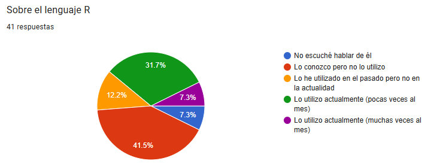
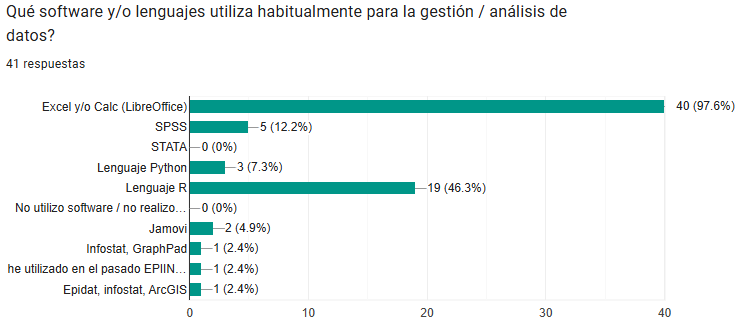
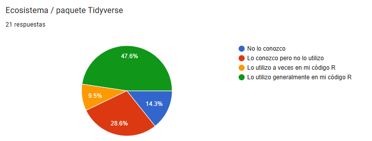
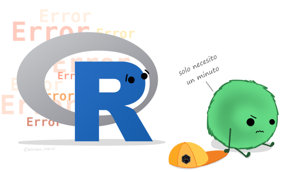
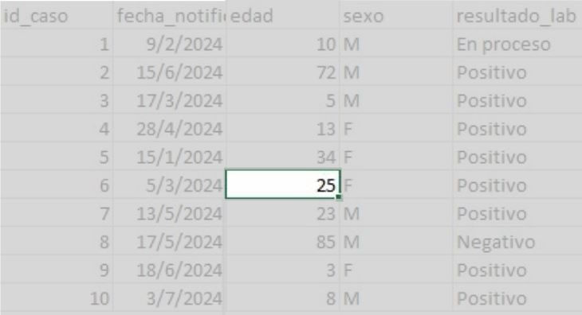
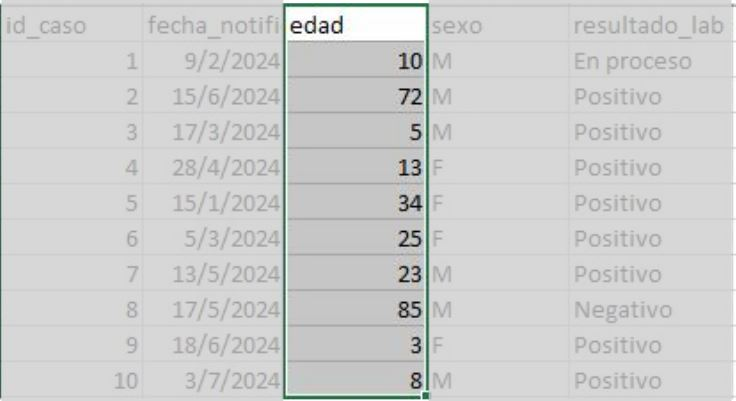

```{r}
#| echo: false
# Configuración global
knitr::opts_chunk$set(echo = FALSE,
                      warning = FALSE,
                      message = FALSE,
                      fig.align = "center")

# Paquetes necesarios
pacman::p_load(
  flextable,
  patchwork,
  rio,
  janitor,
  tidyverse
)
```

## Curso de Epidemiología - Nivel Avanzado {style="text-align: center;"}

[Unidad 1: Introducción a R]{.custom-title}

[Encuentro 12/05/2026]{.custom-subtitle}

{.absolute bottom="40" left="850" width="800"}

[artwork por allison horst]{.custom-artwork}

## Objetivo de esta Unidad

<br>

> Introducir y nivelar al grupo de estudiantes del curso de **Epidemiología Nivel Avanzado** en el lenguaje R, con el fin de aplicarlo en el proceso de análisis de la siguientes unidades.

<br> <br>

. . .

::: callout-warning
## Aclaración

> Este **NO es un curso de R**, solo lo usaremos como una herramienta para la cursada
:::

## Set mímino de herramientas

{.absolute bottom="0" left="600" width="1000"}

<br>

> Buscamos que todxs lxs estudiantes cuenten al menos con un set mínimo de herramientas para utilizarlas durante el año.

. . .

> Además de las bases que mostremos en esta dos semanas, iremos incorporando nuevas herramientas durante las siguientes unidades.

## Competencias a lograr

<br>

. . .

-   Instalar R + RStudio + Rtools

. . .

-   Gestionar proyectos de RStudio

. . .

-   Entender los fundamentos del lenguaje R y tidyverse

. . .

-   Gestionar paquetes (instalación y activación)

. . .

-   Utilizar herramientas de RStudio

. . .

-   Leer tablas de datos

. . .

-   Realizar análisis exploratorios de datos (básico)

## De donde partimos...



## De donde partimos...



## De donde partimos...



## Dificultades

<br>

Algunas de las dificultades que se van a encontrar en el camino:

<br>

::: {.fragment .fade-in-then-semi-out}
**R** es un lenguaje de *línea de comandos* por lo que su **curva de aprendizaje es lenta**
:::

<br>

::: {.fragment .fade-in-then-semi-out}
Hay muchas funciones y muchos paquetes. Es fácil **confundirse** y no recordar
:::

<br>

::: {.fragment .fade-in-then-semi-out}
Muchas veces la Ayuda no es clara
:::

<br>

::: {.fragment .fade-in-then-semi-out}
Hay que aprender a lidiar con los errores y no frustarse
:::

{.absolute bottom="15" left="995" width="650"}

<br>

::: {.fragment .fade-in-then-semi-out}
Muchas veces los errores tampoco son claros
:::

## Consejos

<br>

> La practica vale más que la teoría. Cuanto mas horas de uso le dediquen al lenguaje mejor.

. . .

<br>

> Pidan ayuda cuando se vean extraviada/os o confundida/os (el foro de ayuda está permanentemente abierto)

. . .

<br>

> Aprendan a utilizar las herramientas de autocompletado de RStudio (van a minimizar la tasa de error de sintaxis)

## Consejos

<br>

> Sean prolija/os al escribir dentro de los scripts. Dejen espacios donde corresponda y saltos de líneas para hacer el código más legible. Visiten la hoja de estilo del lenguaje.

. . .

<br>

> Documenten los pasos que vayan desarrollando utilizando comentarios (#). Les servirá para entender que es lo que hicieron cuando reutilicen ese script.

. . .

<br>

> Organicen una estructura de carpetas con las unidades del curso donde descargue el material y los proyectos de R. Podrán buscar los recursos rápidamente cuando los necesiten

## Cómo vamos a trabajar en la práctica?

<br>

-   Cada unidad tiene actividades prácticas.

-   En cada una de ellas el esquema de trabajo será similar:

. . .

1.  Descargar una carpeta comprimida (archivo **zip**)

2.  Descomprimir el archivo (almacenar su contenido en la computadora)

::: callout-warning
## Cuidado

No trabajen dentro del archivo comprimido porque perderán sus avances.
:::

3.  Abrir proyecto de R incluido en la carpeta

4.  Abrir y ejecutar el script de R guiado o crear script (si la consigna lo pide)

## Durante el curso

<br>

**No vamos a tener que hacer...**

-   trabajos de limpieza y organización de tablas de datos.

-   manipular datos y exploración exhaustiva

**Habitualmente vamos a...**

-   leer archivos de datos (texto plano -txt- o Excel)

-   recategorizar variables, convertirlas a factor y configurar niveles.

-   aplicar funciones comunes de tidyverse

-   aplicar funciones estadísticas específicas

-   utilizar sintaxis fórmula en los modelos de regresión

## IA generativa como asistente del análisis de datos en R 

<br>

- Los **Modelos de Inteligencia Artificial Generativa** (como **Gemini**, **Chatgpt**, **Claude** y otros) capaces de crear contenido (texto, código, imágenes) a partir de una instrucción (*prompt*), pueden ser herramientas poderosas para realizar tareas vinculadas al análisis de datos en lenguaje R.

- Dado que convierte el lenguaje natural en el lenguaje de programación que necesitamos para el análisis en salud, podemos usarla responsablemente y con ciertos criterios éticos.

## Riesgos a tener cuenta

<br>

::: incremental

- El **"Riesgo de la alucinación"** (fallo de código): La IA puede generar código incorrecto, obsoleto o que no se ajusta a las últimas versiones de un determinado paquete. Siempre ejecuten y verifiquen el código línea por línea. No copien y peguen sin entender que hacen.

- El principio de la **Caja Negra** (opacidad): Confiar ciegamente en el código genera una dependencia que inhibe el aprendizaje profundo de R y la lógica de programación. (pereza cognitiva). La IA debe ser una herramienta para *aprender*, no un reemplazo de la comprensión. El objetivo es comprender la lógica de cada función generada.

:::

## Riesgos a tener cuenta

<br>

::: incremental

- Privacidad y datos sensibles (ética): **NUNCA ingresen datos reales** (incluso anonimizados) o sensibles de personas en el prompt de una IA pública. Use datos ficticios o descripciones de la estructura del data frame (ej. "tengo una columna edad numérica y una columna diagnostico categórica").

- Sesgos y contexto: La IA no comprende el contexto epidemiológico complejo. El código puede ser correcto, pero la interpretación sigue siendo responsabilidad humana. El prompt debe ser lo más específico posible para mitigar ambigüedades. La validación del resultado final es indispensable.

:::

## En resumen

<br>

La IA puede ser un asistente y ayudarnos, pero como profesionales nosotros generamos el conocimiento y somos responsables de lo que informemos y/o publiquemos.

::: incremental

- Usémosla para aprender y entender el código.

- Verifiquemos procesos y resultados.

- No compartamos información confidencial.

:::

## Aclaración

<br>

Si bien el curso promueve el uso de herramientas de Inteligencia Artificial (IA) de manera ética, responsable y con criterio académico. Estas solo podrán emplearse, entre otros fines, para la búsqueda de información (que deberá ser debidamente verificada), la corrección de código en R y la revisión gramatical y ortográfica de textos.

<br>

. . . 

No se permitirá el uso de código generado automáticamente sin comprensión de su funcionamiento o que no pueda ser reproducido por el/la estudiante (uso como “caja negra”), ni la delegación en estas herramientas de la interpretación estadística o epidemiológica en trabajos prácticos. Asimismo, se considera una falta grave su utilización no ética en instancias de evaluación.


## Un prompt bien construido


::: {.fragment .fade-in-then-semi-out}

1. **Contexto de lenguaje y paquetes**: Especificar siempre que se necesita código R usando las librerías del tidyverse u otras. También en uso de tuberías. 

:::

::: {.fragment .fade-in-then-semi-out}

2. **Estructura de los datos (input)**: Describir el input. ¿Cómo se llama el data frame? ¿Cuáles son los nombres de las variables que van a usar? ¿Qué tipo de datos contienen (numéricos, categóricos, fechas)?

:::

::: {.fragment .fade-in-then-semi-out}

3. **Tarea específica (gestión/análisis)**: Indicar claramente qué se quiere lograr con el código (filtrar, agrupar, calcular la media, crear un gráfico, etc.).

:::

::: {.fragment .fade-in-then-semi-out}

4. **Resultado esperado (output)**: Mencionar cómo se espera que sea la salida. ¿Un nuevo data frame? ¿Una tabla resumida? ¿Un gráfico específico?

::: 

## ¿Qué es un dato? Bases conceptuales para el análisis estadístico

-   **Definición**: Unidad mínima de información resultado de la operacionalización de una característica o constructo teórico en una unidad de análisis, mediante reglas de medición y registro.

-   **Ejemplo:** la edad registrada en una historia clínica.

{fig-align="center"}

**Idea clave:** los datos sólo tienen significado en su contexto (quién, cuándo, donde, cómo, para qué) y generalmente son una reducción del fenómeno

## Desde lo técnico: Variable vs Valor

<br>

::::: columns
::: {.column width="65%"}
-   **Variable:** característica que puede variar entre observaciones. Se ubica en columnas y tiene un tipo de dato definido.
:::

::: {.column width="35%"}
{fig-align="center"}
:::
:::::

. . .

::: {style="font-size: 80%;"}
-   Ej.: edad, sexo, diagnóstico, fecha de consulta.
:::

. . .

::: {style="font-size: 90%;"}
-   **Valor:** manifestación concreta de la variable para una unidad de análisis.
-   Ej.: edad = 45 (numérico); sexo = F (caracter); fecha de consulta = 2025-11-28 (fecha).
:::

## Variables

- Generalmente partimos desde un **concepto teórico / constructo**: (ej: nivel socioeconómico, depresión, hacinamiento, etc)

- En función de nuestro marco teórico optamos por una **definición conceptual** (basado en qué entendemos por eso en nuestro marco teórico)

- **Operacionalización**: cómo lo vamos a traducir en algo medible (ej: ingresos, educación, escala validada)

- **Medición / registro**: instrumento concreto de medición + sistema de carga (encuesta, historia clínica, base administrativa)

- **Variable**: la forma final en la tabla (para R es una columna con valores)

*Cada transición implica decisiones teóricas y operativas que condicionan el dato final*.  @almeida1992epidemiologia

## Unidad de análisis

::::: columns
::: {.column width="60%"}
-   Entidad básica sobre el que se registran los datos. Se ubica en las filas y constan de un conjunto de variables.
:::

::: {.column width="40%"}
{fig-align="center"}
:::
:::::

-   Ejemplos en salud: **Paciente**, **Consulta**, **Evento** (p. ej. notificación de enfermedad), **Hospital**, etc.

**Por qué importa:** la elección condiciona el diseño, la agregación, la dependencia y la interpretación.

## Del fenómeno al dato: cómo se construye la información epidemiológica

Vimos que desde el plano técnico: 

- una fila = unidad de análisis
- una columna = variable
- un valor = medición

Pero enlazado con el plano teórico:

- El dato es un registro producido, a veces no observado directamente que depende de:

- definiciones (caso, exposición)
- instrumentos (encuesta, historia clínica)
- sistema de registro (vigilancia, tipo de estudio)

## Metadatos: diccionario de datos

<br>

- Son *"los datos que hablan de los datos"* e inseparables de cualquier tabla de datos que trabajemos.

- Describen origen de recolección, fecha, definiciones conceptuales y técnicas, tipo de estudio al que están asociados, etc.

::: {style="font-size: 80%;"}
Delimitador de variables: ;

Delimitador de decimales: ,

| Variable           |       Tipo | Descripción           | Valores posibles |
|--------------------|-----------:|-----------------------|------------------|
| id_caso            |   numérico | Identificador único   | 1,2,3...         |
| edad               |   numérico | Edad en años          | 0–120            |
| sexo               | categórica | Sexo biológico        | M, F, O          |
| fecha_notificacion |      fecha | Fecha de notificación | AAAA-MM-DD       |
| diagnostico        | categórica | Código CIE10          | Formato CIE10    |
:::


## Para finalizar

<br>

- Los datos dependen de las ideas que los organizan. @becker2018datos. Y podemos agregar, que estas ideas están mediadas por relaciones de poder, historia y posición geopolítica.

- En epidemiología, los datos son el resultado de decisiones teóricas, operativas e institucionales; analizarlos sin explicitar estos supuestos debilita la inferencia. @de2000ciencia 

- Los análisis que desarrollaremos durante la cursada los debemos ver como un proceso iterativo entre hipótesis y datos -que dialogan entre sí- , no solo una aplicación mecánica y matemática.

## Temario del encuentro de hoy

<br>

-   Crear, abrir y cerrar proyectos de RStudio

-   Crear, abrir y guardar scripts

-   Usar autocompletado de RStudio, búsqueda y ayuda

-   Instalar y gestionar paquetes

-   Vectores y dataframes

-   Operador de asignación

-   Sintaxis diferenciada (R base y tidyverse)

-   Responder preguntas, aclarar dudas, etc...

## Referencias

<br>
