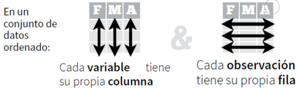
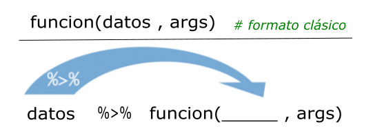

```{r}
#| echo: false
# Configuración global
knitr::opts_chunk$set(echo = FALSE,
                      warning = FALSE,
                      message = FALSE,
                      fig.align = "center")

# Paquetes necesarios
pacman::p_load(
  flextable,
  patchwork,
  rio,
  janitor,
  tidyverse
)
```

## Curso de Epidemiología - Nivel Avanzado {style="text-align: center;"}

[Unidad 1: Introducción a R]{.custom-title}

[Encuentro 19/05/2026]{.custom-subtitle}


{.absolute bottom="65" left="900" width="850"}

[artwork por allison horst]{.custom-artwork}

## tidyverse {.title-top}

{.absolute top="120" left="650" width="250"}

<br> <br> <br> <br> <br><br> <br>

[Una colección de paquetes de R modernos, que comparten una **gramática** y **filosofía** común, diseñados para resolver los desafíos de la ciencia de datos.]{style="font-size:140%;"}

## Fundamentos principales de tidyverse {.title-top}

. . .

{.absolute top="250" left="980" width="700"}

-   **Estructura ordenada de datos (tidy)**

::: {.fragment .fade-in-then-semi-out}
-   Cada *variable* es una *columna* de la tabla de datos
:::

::: {.fragment .fade-in-then-semi-out}
-   Cada *observación* es una *fila* de la tabla de datos
:::

::: {.fragment .fade-in-then-semi-out}
-   Cada *tabla* responde a una *unidad de análisis*
:::

. . .

-   **Principios básicos**

::: {.fragment .fade-in-then-semi-out}
-   Reutilizar las estructuras de datos
:::

::: {.fragment .fade-in-then-semi-out}
-   Resolver problemas complejos combinando (con tuberías) varias piezas sencillas
:::

::: {.fragment .fade-in-then-semi-out}
-   Diseño de las funciones para humanos incorporando gramática al lenguaje
:::

## Aprendizaje con enfoque "comunicativo" {.title-top}

{.absolute bottom="18" left="500" width="630"}

. . .

> Abordaje de R como un lenguaje para **"comunicarse"** (similar a un segundo lenguaje como el inglés, francés, etc.)

. . .

> Detectar estructura **semántica**, **gramatical** y **sintáctica**.

. . .

> Se busca comenzar a **"decir cosas con datos"** en vez de profundizar en las estructuras del lenguaje.

. . .

> El objetivo es convertirse en **"usuario/a"** del lenguaje y no un/a **"programador/a"**.

## Sintaxis R base vs tidyverse {.title-top}

-   En la sintaxis del R base el símbolo **\$** es protagonista.

Acompaña al nombre de la tabla de datos (dataframe) cuando queremos llamar a las variables contenidas en ella.

<br>

```{r}
#| eval: false
#| echo: true

datos$x                   # variable x en datos

funcion(datos$x, datos$y) # variables x e y en datos
```

<br>

La mayoría de las funciones de R base trabajan sobre vectores o variables de dataframes que internamente se parecen a vectores.

## Sintaxis R base vs tidyverse {.title-top}

-   En la sintaxis del ecosistema tidyverse el protagonista es el símbolo **%\>%** o **\|\>**.

> Es una tubería (*pipe en inglés*) que sirve para **conectar** partes de código.

Estas estructuras de código inician con el llamado a la tabla de datos.

<br>

```{r}
#| echo: true
#| eval: false

datos %>% función(x, y)  # el atajo de teclado es Ctrl+Shift+M
```

-   La diferencia entre las dos formas sintácticas es:

{.absolute bottom="22" left="500" width="650"}

## Lectura de datos {.title-top}

<br>

Durante el curso vamos a trabajar con archivos de datos en *formato plano*, separador **;** y extensión **.txt** generalmente. También podemos llegar a tener que importar datos de algún archivo **Excel** y *datasets* que ya vienen incorporados en paquetes de R.

La función de lectura para los archivos planos será `read_csv2()` del paquete **readr** que integra tidyverse.

<br>

::: fragment
```{r}
#| echo: true
#| eval: false
library(tidyverse)

datos <- read_csv2("nombre_archivo.txt")

```

<br> Siempre que importemos datos debemos recordar asignarlos (`<-`) a un objeto que se convertirá en el dataframe contenedor de la tabla leída.
:::

## Lectura de datos {.title-top}

<br>

La función de lectura para los archivos Excel será `read_excel()` de **readxl** que también es parte de tidyverse, aunque en este caso tenemos que activarlo individualmente porque no es parte del grupo núcleo de paquetes.

<br>

::: fragment
```{r}
#| echo: true
#| eval: false
library(tidyverse)
library(readxl)

datos <- read_excel("nombre_archivo.xlsx")

```
:::

<br>

::: fragment
El archivo de Excel puede ser **.xlsx** o uno de formato antiguo **.xls**. Siempre que los datos se encuentren en la primera hoja del libro de trabajo de Excel y comience su cabecera en la primera fila, no hace falta configurar ningún argumento más.
:::

## Análisis exploratorio de datos {.title-top}

<br>

:::::: {style="font-size:120%;"}
Los objetivos básicos perseguidos por el análisis exploratorio de datos son:

::: {.fragment .fade-in-then-semi-out}
-   Conocer la estructura de la tabla de datos y sus tipos de variable
:::

::: {.fragment .fade-in-then-semi-out}
-   Detectar observaciones incompletas (valores missing)
:::

::: {.fragment .fade-in-then-semi-out}
-   Conocer la distribución de las variables de interés a partir de:

    -   Resumir datos mediante estadísticos

    -   Resumir datos mediante gráficos

    -   Detectar valores atípicos
:::
::::::

## Conocer la estructura de los datos {.title-top}

::: {style="font-size:110%;"}
-   Consiste en una exploración técnica asociada a elementos informáticos pero a su vez busca relacionarse con la clasificación estadística de las variables de estudio.

-   Suele realizarse de la mano de un *"diccionario de datos"* producido durante el proceso de recolección.

-   Los tipos de datos elementales que maneja R son: *numéricos enteros* (**integer**), *numéricos reales* (**numeric/double**), *caracter* (**character**), *factor* (**factor**), *lógicos* (**logical**), *fecha* (**date**) y *fecha-hora* (**dttm**).

-   La clasificación estadística de las variables referida es la clásica: *variables cualitativas* y *cuantitativas*, *continuas* y *discretas*, con escalas *nominales*, *ordinales*, de *intervalo* y de *razón*.
:::

## Detectar observaciones incompletas (valores missing) {.title-top}

::::: columns
::: {.column width="50%"}

::: {style="font-size: 80%;"}
-   Identificar los valores faltantes en las variables nos permite conocer con que tamaño muestral estamos trabajando frente a cada estadístico calculado.

-   También si los valores ausentes se produjeron al azar o existe algún proceso informativo vinculado. Esto nos permite decidir como continuar con nuestro análisis.

- Solemos descartar la variable, cuando la proporción de valores faltantes es alta en el conjunto de observaciones para dicha variable.

- Existen técnicas de imputación de valores que escapan al temario que integra este curso. 

- En todos los casos se debe informar explícitamente lo que hizo con esos valores ausentes.
:::
:::

::: {.column width="50%"}
```{r}
#| echo: false 
#| message: false 
#| warning: false 
#| fig-height: 9

library(dlookr)

showtext::showtext_opts(dpi = 300)

SEXO <- c(rep(NA, 6),seq(1,4, length.out = 8)) 
EDAD <- c(rep(NA, 3),seq(1,4, length.out = 11)) 
EDUCACION <- c(rep(NA, 12),seq(1,4, length.out = 2))
datos <- data.frame(SEXO, EDAD, EDUCACION) 
plot_na_pareto(datos)
```
:::
:::::

## Que vamos a mostrar en R/RStudio hoy {.title-top}

{.absolute top="250" left="800" width="700"}

<br>

-   Lectura de datos

-   Tuberías y sintaxis

-   Creación de nuevas variables

-   Conversión de factores

-   Exploración y diagnóstico

-   Valores ausentes

-   Análisis descriptivo

-   Datos atípicos

-   Consignas del TP evaluativo
